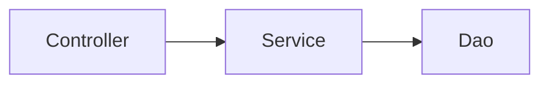

```
controller：控制层，接收前端发送的请求，对请求进行处理，并响应数据。
service：业务逻辑层，处理具体的业务逻辑。
dao：数据访问层(Data Access Object)（持久层），负责数据访问操作，包括数据的增、删、改、查。
```

**Controller层**
```java
//EmpController     
@RestController
public class EmpController {

    private EmpService empService = new EmpServiceA();

    @RequestMapping("/listEmp")
    public Result list() {
        //1. 调用service, 获取数据
        List<Emp> empList = empService.listEmp();

        //3. 响应数据
        return Result.success(empList);
    }
}
```

**Service层**
```java
//EmpServiceA
public class EmpServiceA implements EmpService {
    private EmpDao empDao = new EmpDaoA();

    @Override
    public List<Emp> listEmp() {
        //1. 调用dao, 获取数据
        List<Emp> empList = empDao.listEmp();

        //2. 对数据进行转换处理 - gender, job
        empList.stream().forEach(emp -> {
            //处理 gender 1: 男, 2: 女
            String gender = emp.getGender();
            if("1".equals(gender)){
                emp.setGender("男");
            }else if("2".equals(gender)){
                emp.setGender("女");
            }

            //处理job - 1: 讲师, 2: 班主任 , 3: 就业指导
            String job = emp.getJob();
            if("1".equals(job)){
                emp.setJob("讲师");
            }else if("2".equals(job)){
                emp.setJob("班主任");
            }else if("3".equals(job)){
                emp.setJob("就业指导");
            }
        });
        //3. 返回处理结果
        return empList;
    }
}
```
**Dao层**
```java
//EmpDaoA
public class EmpDaoA implements EmpDao {
    @Override
    public List<Emp> listEmp() {
        //1. 加载并解析emp.xml
        String file = this.getClass().getClassLoader().getResource("emp.xml").getFile();
        System.out.println(file);
        List<Emp> empList = XmlParserUtils.parse(file, Emp.class);
        return empList;
    }
}
```